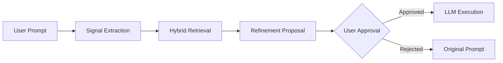

# Cognitive Continuity Layer

A persistent, contextual memory and **behavioral intelligence** system for AI Assistants. This Model Context Protocol (MCP) server enables assistants to learn communication patterns, task constraints, and successful interaction journeys across sessions.

## 🚀 Key Features (Phase 1)
- **Episodic Learning**: Captures and analyzes interaction journeys to distill knowledge from clarified confusion.
- **Friction-Awareness**: Measures clarifying cycles to identify high-value learning opportunities.
- **Hybrid Retrieval**: Combines semantic, sparse (BM25), and episodic similarity for superior context relevance.
- **Zero Silent Mutation**: Strictly enforces a human-in-the-loop preview/confirm flow for prompt refinements.
- **Multi-Collection Storage**: Specialized ChromaDB collections for episodes, patterns, rules, and contexts.

## 📊 System Flow
The system follows a strict behavioral retrieval and refinement pipeline. See [Detailed Architecture & Program Flow](docs/architecture.md#3-complete-end-to-end-program-flow) for the full sequence diagram.



## 🛠️ Setup

> [!TIP]
> For a detailed walkthrough of steps needed after a fresh clone, see the [Post-Clone Setup Guide](docs/setup-guide.md).


### Prerequisites
- Node.js (v18+)
- Python (3.12+)

### 1. Memory Engine (Backend)
```powershell
cd memory-engine-py
python -m venv venv
.\venv\Scripts\Activate.ps1
pip install -r requirements.txt
uvicorn app.main:app --port 8001
```

### 2. MCP Server (Frontend)
```powershell
cd mcp-server-ts
npm install
npm run build
```

## ⚙️ Configuration
Add the server to your assistant's MCP configuration. See [MCP Configuration Guide](docs/mcp-configuration.md) for IDE-specific details.

## ✅ Validation
Run the unified validation script to verify the entire stack:
```powershell
.\validate_all.ps1
```

## 📄 Documentation
- [Post-Clone Setup Guide](docs/setup-guide.md)
- [Architecture & Detailed Flow](docs/architecture.md)
- [API Contract](docs/api-contract.md)
- [Test Plan](docs/test-plan.md)
- [Task Tracker](docs/task_tracker.md)

