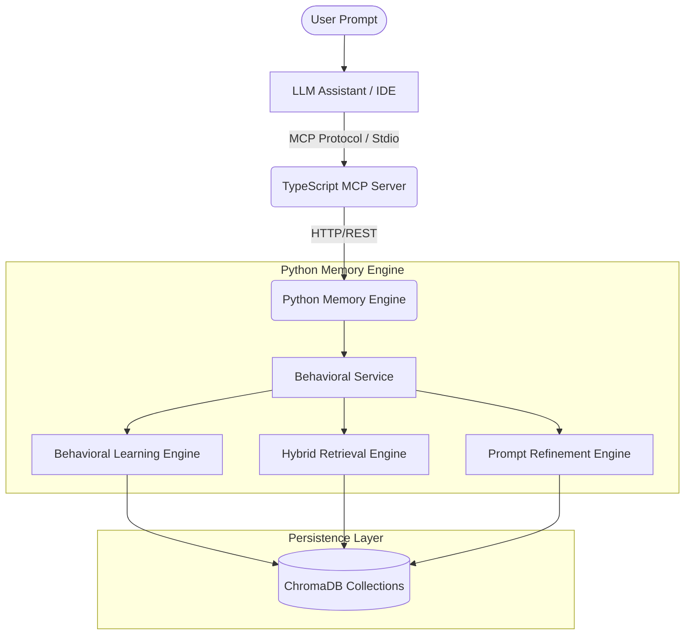
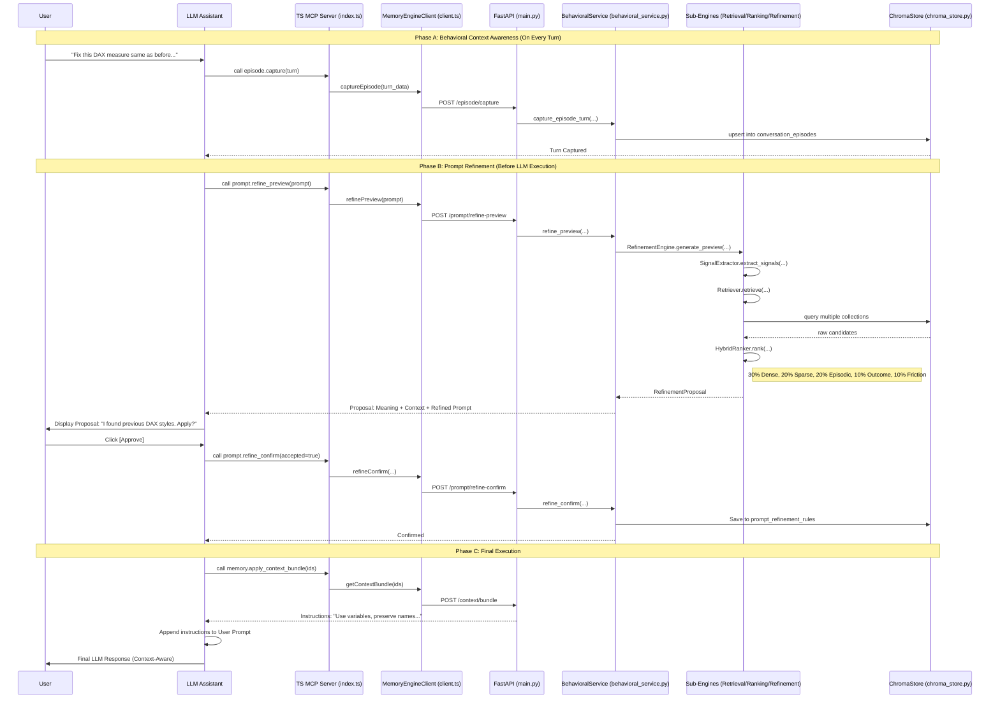
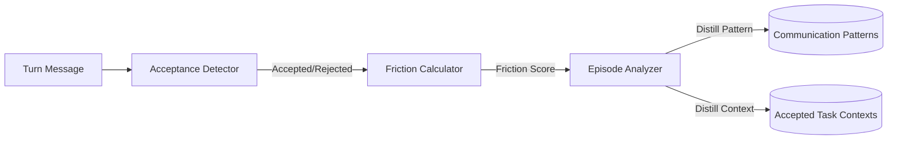
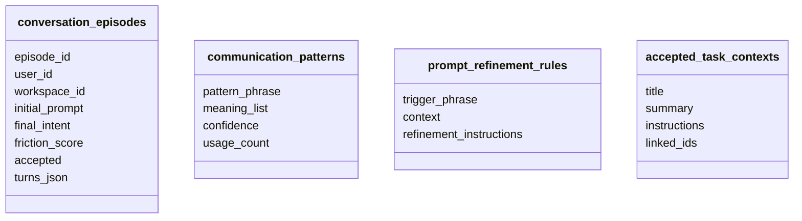

# Cognitive Continuity Layer Architecture

## 1. Core Philosophy
The Cognitive Continuity Layer transforms an AI assistant from a stateless respondent into a context-aware partner. By maintaining persistent state across isolated sessions, the system learns communication styles, task-specific constraints, and successful interaction patterns.

---

## 2. System Topology (High-Level)
This flowchart shows the high-level components and the primary communication protocol (MCP over Stdio and REST over HTTP).



---

## 3. Complete End-to-End Program Flow
This sequence diagram covers the full lifecycle from user prompt intake to final LLM execution with refined context.



---

## 4. Episode Capture and Learning Flow
The learning engine distills knowledge from high-friction but successful interaction journeys.



---

## 5. Storage Model (ChromaDB Collections)
Persistence is bifurcated into four specialized collections to optimize retrieval strategies.



---

## 6. MCP Tool to API Mapping
This diagram maps the high-level MCP tools exposed to the LLM to their internal REST counterparts.

```mermaid
graph LR
    subgraph "MCP Server (TS)"
        T1[memory.save]
        T2[memory.search]
        T3[episode.capture]
        T4[episode.analyze]
        T5[prompt.refine_preview]
        T6[prompt.refine_confirm]
    end
    
    subgraph "Memory Engine (Python)"
        A1[/memory/save]
        A2[/memory/search]
        A3[/episode/capture]
        A4[/episode/analyze]
        A5[/prompt/refine-preview]
        A6[/prompt/refine-confirm]
    end
    
    T1 --> A1
    T2 --> A2
    T3 --> A3
    T4 --> A4
    T5 --> A5
    T6 --> A6
```

---

## 7. Function and File Mapping

| Function/Class | File Path | Responsibility | Input | Output | Downstream Dependency |
| :--- | :--- | :--- | :--- | :--- | :--- |
| `Server` | `mcp-server-ts/src/index.ts` | MCP Protocol Entrypoint | Stdio | JSON-RPC | `MemoryEngineClient` |
| `MemoryEngineClient` | `mcp-server-ts/src/client.ts` | Backend HTTP bridge | JS Objects | Promise<JSON> | FastAPI Endpoints |
| `BehavioralService` | `memory-engine-py/app/behavioral_service.py` | Orchestration | Request Objects | Response Models | `EpisodeAnalyzer`, `BehavioralRetriever`, `PromptRefinementEngine` |
| `EpisodeAnalyzer` | `memory-engine-py/app/episode_analyzer.py` | Knowledge distillation | `ConversationEpisode` | `AnalyzedEpisode` | `AcceptanceDetector`, `FrictionCalculator` |
| `BehavioralRetriever` | `memory-engine-py/app/behavioral_retriever.py` | Multi-strategy fetching | Query String | `List[Candidate]` | `ChromaStore`, `HybridRanker` |
| `HybridRanker` | `memory-engine-py/app/hybrid_ranker.py` | Context scoring | `List[Candidate]` | `List[Ranked]` | N/A |
| `PromptRefinementEngine` | `memory-engine-py/app/prompt_refinement_engine.py` | Proposal Synthesis | Prompt + Context | `RefinementProposal` | `SignalExtractor`, `BehavioralRetriever` |
| `ChromaStore` | `memory-engine-py/app/chroma_store.py` | Vector Persistence | Document + Meta | Query Results | ChromaDB |

---

## 8. Technical Review: Detailed Process Flows

### 8.1 Runtime Startup Flow
1. **Memory Engine (Python)**: `uvicorn app.main:app` initializes the `ChromaStore` (creating collections if missing) and the `BehavioralService`.
2. **MCP Server (TS)**: `npm run start` (or `node dist/index.js`) connects to the Stdio transport and registers the 11 available tools.
3. **Integration**: The LLM environment loads the MCP configuration, mounting the tools into the assistant's runtime.

### 8.2 Retrieval and Ranking Flow
When `prompt.refine_preview` is called:
- **Signals**: `SignalExtractor` finds JIRA IDs, task types (e.g., "fix"), and behavioral phrases ("same as before").
- **Retrieval**: Parallel queries are sent to all four Chroma collections using the extracted signals.
- **Ranking**: The `HybridRanker` applies the formula:
  - `30%` Dense Embedding similarity.
  - `20%` Sparse keyword overlap (pseudo-BM25).
  - `20%` Episodic match (historical journeys).
  - `10%` Previously accepted outcome bonus.
  - `10%` Friction reduction bonus.
  - `5%` Recency.
  - `5%` Model/Success rate.

### 8.3 Prompt Refinement Approval Flow
1. **Preview**: The assistant calls `prompt.refine_preview`.
2. **Consent**: The user sees the "Interpreted Meaning" and "Retrieved Context".
3. **Confirmation**: Only if the user approves (`refine_confirm`) does the assistant proceed to use the refined prompt. This ensures **zero silent prompt mutation**.

---

## 9. Important Notes

### 9.1 GraphQL
> [!NOTE]
> GraphQL is NOT used for this MVP to maintain simplicity and speed. A GraphQL API layer may be considered in future phases if a complex dashboard or multi-tenant query interface is required.

### 9.2 CodeQL
> [!NOTE]
> CodeQL is not used for architecture flow visualization. It is a security/static analysis tool and may be integrated into the CI/CD pipeline in later phases for codebase hardening.

---

## 10. Known Limitations & Future Work
- **BM25 Heuristic**: Due to environment restrictions, a simplified keyword overlap is used instead of the full `rank-bm25` library.
- **Code Learning**: Deep code structure learning (beyond JIRA/File associations) is planned for Phase 2.
- **Shared Memory**: Workspace-wide memory sharing logic is currently minimal.
- **Auth**: Native enterprise auth (SSO) is currently stubbed for local dev.
